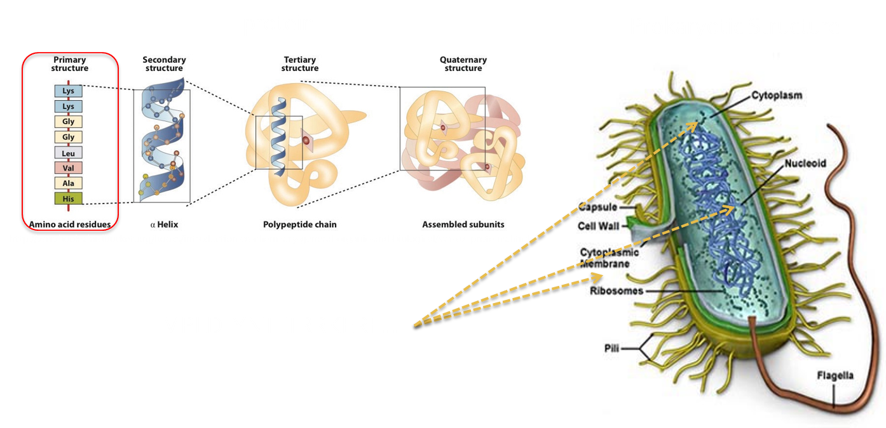
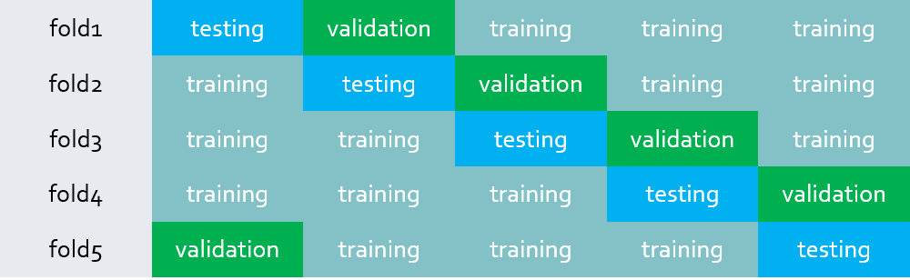

# 2125Q4



#### Name: your name
#### ID: student ID

## Description
Perform *k*-fold cross-validation for tuning the following parameters of a random forest model.
  * ntree: your answer
  * mtry: your answer
  * maxnodes: your answer

### cmd
```R
model <- k_fold(k, './data/Archaeal_tfpssm.csv', 'performance.csv')
data <- preprocess('./data/hiddenData.csv')
pred <- predict(model, newdata = data)
```

### *k*-fold cross-validation
* Divide the data into *k* parts, the number of parts used by each data set
  * (training, validation, testing) = (*k*-2, 1, 1)
* The following shows the example of the 5-fold cross validation.

<br> 



### Input: Archaeal_tfpssm.csv

[📁 Archaeal_tfpssm.csv download](https://drive.google.com/file/d/1N99q71GckX0lzxCqpcGUStke3iNv__nG/view?usp=sharing)

This CSV doesn't contain a header. The information of columns as below:

* `V2`: labels of proteins
  * CP: Cytoplasmic
  * CW: Cell Wall
  * EC: Extracellular
  * IM: Inner membrane

* `V3 ~ V5602`: the gapped-dipeptide features of each protein

### Output format: performance.csv

* accuracy = *P*/*N*, average of *k*-fold cross-validation

set|training|validation|test
---|---|---|---
fold1|0.93|0.91|0.88
fold2|0.92|0.91|0.89
fold3|0.94|0.92|0.90
fold4|0.91|0.89|0.87
fold5|0.90|0.92|0.87
ave.|0.92|0.91|0.88


### Code for reference

```R
library(randomForest)

preprocess <- function(input_data){
  # read input data


  # data preprocessing


  # return data to train & predict
  return (data)
}

k_fold <- function(fold, input_file, output_file){
  
  # model using random forest & tune best parameters
  model <- randomForest(ntree, mtry, maxnodes)
  # make confusion matrix tabel
  resultframe <- data.frame(truth=tmp$V2,
                            pred=predict(model, type="class"))
  # output the confusion matrix                        
  write.csv()

  cat('ntree:', your answer)
  cat('mtry:', your answer)
  cat('maxnodes:', your answer)

  return (your_model)
}
```

## Targets
### Target1: difference between ave. test Acc & the Acc of the hidden data(50%)
The closest to zero gets 50%; the furthest gets 10%. Others are scored in order.

### Target2: the Acc of the hidden data(50%)
The highest gets 50%; the lowest gets 10%. Others are scored in order.

* We will have hidden data beyond Archaeal_tfpssm.csv to evaluate your model. The number of the data is less than Archaeal_tfpssm.csv.
* You must design your own test cases to ensure that the code can pass the test by TA. 💪💪

## Note
- Please use R version 4
- Filename format of your code: `hw3.R`
- Please do not set input/output in your local path or URL. Otherwise, your code will fail due to a fixed path problem.
- execution time: 5 minute maximum
- Only the `randomForest` package can be used as a predictive model, no additional packages are allowed.
- Split *k*-fold by yourself, the function `rfcv` is not allowed.
- If you cheat, you'll get zero for this assignment, and there's no chance to make up for it. 😠 
  - i.e., makeup performance.csv without *k*-fold process or other cheating methods

## References
Please list the code and its reference.

If needed, you should explain the details, i.e., comment like # ChatGPT, respond to “your prompt,” February 16, 2023.

Data Set:
* Chang, J.-M. M. et al. (2013) [Efficient and interpretable prediction of protein functional classes by correspondence analysis and compact set relations](https://journals.plos.org/plosone/article?id=10.1371/journal.pone.0075542). *PLoS ONE* 8, e75542.
* Chang J-M, Su EC-Y, Lo A, Chiu H-S, Sung T-Y, & Hsu W-L (2008) [PSLDoc: Protein subcellular localization prediction based on gapped-dipeptides and probabilistic latent semantic analysis](https://onlinelibrary.wiley.com/doi/full/10.1002/prot.21944). *Proteins: Structure, Function, and Bioinformatics* 72(2):693-710.
Please list the code and its reference.
